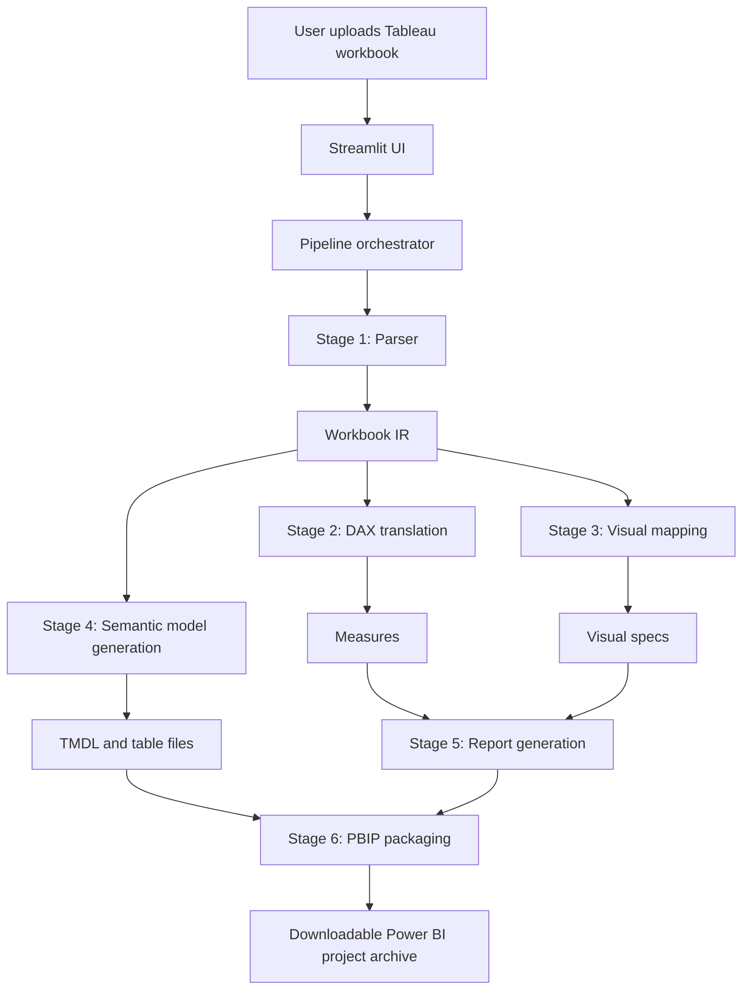
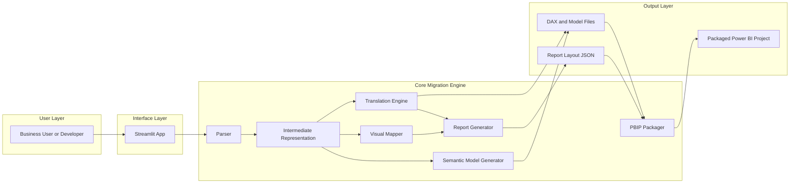
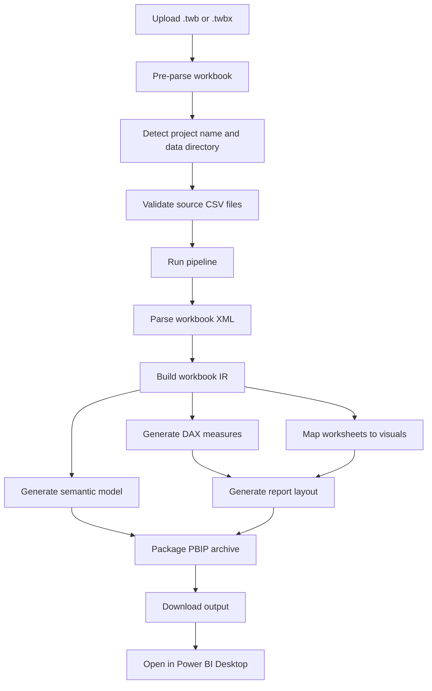

# Tableau to Power BI Migrator

This project converts Tableau workbooks into Power BI assets by parsing a `.twb` workbook, building an internal representation of the workbook structure, translating calculations, mapping visuals, and packaging the result as a Power BI project.

At a high level, the repository contains:

- A Streamlit application for interactive migration.
- A core `tableau_to_powerbi` package that performs parsing, translation, mapping, and packaging.
- Design and reference documents under `docs/`.
- Sample workbook inputs and generated Power BI outputs.

## What This Project Does

Given a Tableau workbook, the project attempts to migrate:

- Data source metadata
- Tables, columns, and relationships
- Calculated fields and worksheet aggregations
- Worksheet visuals and dashboard layout
- Semantic model artefacts for Power BI
- Packaged Power BI project output for download

Typical input and output:

- Input: `.twb` or `.twbx`
- Output: generated Power BI project artefacts, including model, report layout, DAX, Power Query, and packaged archive content

## Important Repo Note

This repository currently shows two architecture tracks:

- The active, workspace-present Streamlit pipeline under `tableau_to_powerbi/`
- A CLI-oriented path in root files such as `cli.py`, `pipeline.py`, and `__main__.py` that references a package named `tableau_to_pbi`

The `tableau_to_pbi` package is not present in the current workspace tree, so the most reliable runnable path in this repo is the Streamlit application backed by `tableau_to_powerbi.pipeline.run_pipeline`.

## Architecture Overview



### System Architecture Diagram



### Execution Flow Chart



## Detailed Flow

The current Streamlit-backed execution flow is:

1. The user uploads a Tableau workbook in `streamlit_app.py`.
2. The app optionally pre-parses the workbook to detect the data directory and suggest a project name.
3. The app calls `tableau_to_powerbi.pipeline.run_pipeline(...)`.
4. The parser reads workbook XML and constructs workbook-level IR objects.
5. The translation layer generates DAX-style measures from Tableau calculations and aggregate usage.
6. The mapping layer converts Tableau worksheet marks and encodings into Power BI visual specifications.
7. The generator layer creates semantic model files, relationships, report layout JSON, and table artefacts.
8. The packager assembles the output into a downloadable Power BI project archive.
9. The Streamlit UI returns the generated file to the user for download.

## Agent and Stage Breakdown

This repo uses the word "agent" mainly as an architectural decomposition, not as a runtime multi-agent framework inside the app. The logical agents or stages are:

| Agent / Stage | Responsibility | Input | Output | Primary Code Surface |
|---|---|---|---|---|
| Streamlit UI Agent | Accept user input, validate configuration, launch migration, expose download | Uploaded workbook, user config | Pipeline request, downloadable file | `streamlit_app.py` |
| Parser Agent | Read Tableau XML, extract datasources, worksheets, dashboards, calculated fields, parameters | `.twb` or `.twbx` bytes | Parsed workbook structures | `tableau_to_powerbi/parser/` |
| IR Builder | Normalize parsed workbook data into internal models used by downstream stages | Parsed workbook metadata | `WorkbookIR` and related models | `tableau_to_powerbi/ir/` |
| DAX Translation Agent | Convert Tableau calculations and aggregation patterns into DAX measures | Workbook IR | Measures and translated logic | `tableau_to_powerbi/translation/` |
| Visual Mapping Agent | Map Tableau marks, shelves, and worksheet structure to Power BI visual specs | Worksheets from IR | Visual specifications | `tableau_to_powerbi/mapping/` |
| Semantic Model Generator | Build Power BI model artefacts, table definitions, and relationships | Workbook IR, measures | TMDL and table artefacts | `tableau_to_powerbi/generator/semantic_model.py` |
| Report Generator | Create report layout JSON and dashboard-to-page mapping | Visual specs, dashboard metadata | Report JSON | `tableau_to_powerbi/generator/report_generator.py` |
| PBIP Packager | Assemble generated files into the downloadable Power BI project package | Model files, report files | Packaged archive bytes | `tableau_to_powerbi/generator/pbip_packager.py` |
| Pipeline Orchestrator | Chain all phases, collect warnings and errors, return a single result | Workbook bytes, project settings | `PipelineResult` | `tableau_to_powerbi/pipeline.py` |

### Agent Interaction Summary

| From | To | Why the Hand-off Happens |
|---|---|---|
| Streamlit UI Agent | Parser Agent | Start migration from uploaded workbook |
| Parser Agent | IR Builder | Convert raw workbook content into normalized internal structures |
| IR Builder | DAX Translation Agent | Translate Tableau logic into Power BI calculations |
| IR Builder | Visual Mapping Agent | Convert Tableau worksheet intent into Power BI visuals |
| IR Builder | Semantic Model Generator | Build model, table, and relationship artefacts |
| DAX Translation Agent | Report Generator | Provide measure names and calculation outputs for visuals |
| Visual Mapping Agent | Report Generator | Provide visual placements and bindings |
| Semantic Model Generator | PBIP Packager | Supply model artefacts for packaging |
| Report Generator | PBIP Packager | Supply report layout artefacts for packaging |
| PBIP Packager | Streamlit UI Agent | Return final downloadable output |

There is also a second, documented pipeline in root-level files that describes these stages in another form:

- Parser
- Power Query M Generator
- DAX Generator
- Visual Generator
- PBIX Assembler
- Publisher
- Validator
- Report Writer

That design appears in `generate_doc.py` and related documentation, but the active app path in this workspace is the `tableau_to_powerbi` package.

## Component Responsibilities

### 1. Streamlit Frontend

The frontend in `streamlit_app.py` is responsible for:

- Uploading `.twb` and `.twbx` files
- Suggesting a project name from the uploaded filename
- Detecting a data directory from the Tableau workbook when possible
- Performing pre-flight validation against CSV files
- Invoking the pipeline
- Letting the user download the generated result

### 2. Pipeline Orchestrator

The orchestrator in `tableau_to_powerbi/pipeline.py` coordinates the migration in six phases:

1. Parse Tableau workbook
2. Generate DAX measures
3. Map visuals
4. Generate semantic model files
5. Generate report layout
6. Package the PBIP archive

### 3. Parser Layer

The parser is responsible for understanding Tableau workbook structure, including:

- Datasources
- Tables and columns
- Worksheets
- Dashboards
- Calculated fields
- Data directory references

It produces the intermediate workbook representation that every later stage depends on.

### 4. Translation Layer

The translation layer converts Tableau logic into Power BI-compatible logic, including:

- Aggregations such as `SUM`, `AVG`, `COUNT`, `MAX`
- Common calculated fields
- Measure creation at workbook level

### 5. Mapping Layer

The mapping layer converts worksheet intent into Power BI visual intent, such as:

- Bars to bar charts
- Lines to line charts
- Areas to area charts
- Cards and KPI-like worksheets to card visuals
- Maps and filled maps to Power BI geographic visuals
- Treemap-like worksheets to Power BI treemaps

### 6. Generator and Packaging Layer

The generator layer creates the Power BI-facing artefacts and the package layer bundles them for downstream use.

Expected artefacts include:

- Semantic model files
- Relationship definitions
- DAX files
- Report layout JSON
- Power Query files
- Final packaged Power BI project output

## End-to-End Project Flow

The whole project can be understood as three larger bands:

### A. Ingestion

- Read Tableau workbook bytes
- Parse workbook structure
- Detect data sources and fields

### B. Transformation

- Build IR objects
- Translate calculations
- Map visuals and dashboard layout
- Prepare semantic model definitions

### C. Emission

- Generate report and model files
- Package output into a downloadable archive
- Open the output in Power BI Desktop for final validation and refresh

## Project Structure

```text
.
├── __main__.py
├── cli.py
├── pipeline.py
├── streamlit_app.py
├── requirements.txt
├── docs/
│   ├── agent_rules.md
│   ├── architecture.md
│   ├── dax_translation_catalog.md
│   ├── ir_schema.md
│   ├── mapping_catalog.md
│   ├── plan.md
│   ├── tasks.md
│   ├── test_strategy.md
│   └── visual_mapping_catalog.md
├── generators/
├── parsers/
├── utils/
├── validators/
├── tableau_to_powerbi/
│   ├── config.py
│   ├── pipeline.py
│   ├── generator/
│   ├── ir/
│   ├── mapping/
│   ├── parser/
│   ├── translation/
│   └── utils/
├── input_twb/
├── output_pbi/
└── Dataset/
```

## Supported Capabilities

| Tableau Feature | Power BI Target | Status |
|---|---|---|
| Tableau workbook XML parsing | Internal workbook IR | Supported |
| Datasource and table extraction | Model metadata | Supported |
| Relationship extraction | Power BI model relationships | Supported |
| Common worksheet aggregations | DAX measures | Supported |
| Common calculated fields | DAX translation path | Supported with limitations |
| Dashboard worksheet mapping | Report pages and visuals | Supported |
| Bar, line, area, pie, map, treemap-like visuals | Corresponding Power BI visuals | Supported |
| Packaged Power BI project output | Downloadable archive | Supported |

## Prerequisites

- Python 3.11 or later
- Power BI Desktop for opening and validating generated output
- Access to the CSV or other underlying data files referenced by the Tableau workbook

Install Python dependencies:

```powershell
pip install -r requirements.txt
```

Current declared dependencies:

- `streamlit`
- `lxml`
- `pydantic`
- `click`

## How to Run

### Recommended: Streamlit UI

From the repo root:

```powershell
streamlit run streamlit_app.py
```

Then in the browser:

1. Upload a Tableau workbook.
2. Confirm or edit the suggested project name.
3. Confirm or edit the data directory path.
4. Review any validation warnings about missing CSV files or mismatched headers.
5. Run the migration.
6. Download the generated Power BI project package.

### Suggested Local Setup

If you want an isolated environment on Windows PowerShell:

```powershell
python -m venv .venv
.\.venv\Scripts\Activate.ps1
pip install -r requirements.txt
streamlit run streamlit_app.py
```

## Example Input Files in This Repo

You can use the bundled samples while testing:

- `Shopping (1).twb`
- `input_twb/sample_sales_dashboard.twb`

Sample data folders are also included:

- `Dataset/`
- `Dataset_BK/`

## What the App Produces

The repository already contains an example generated output tree under `output_pbi/sample_sales_dashboard/`, which shows the kinds of artefacts the pipeline emits:

```text
output_pbi/sample_sales_dashboard/
├── sample_sales_dashboard.bim
├── dax/
│   └── measures.dax
├── ir/
│   └── sample_sales_dashboard.ir.json
├── layout/
│   └── report_pages.json
├── migration_report/
│   ├── field_mapping.csv
│   ├── manual_review.md
│   └── summary.md
└── powerquery/
    └── Orders.pq
```

## How to Open the Result in Power BI

After downloading the generated package:

1. Extract the archive to a local folder.
2. Open the generated Power BI project or related output in Power BI Desktop.
3. Update any data source paths if the original Tableau workbook referenced local files that differ on your machine.
4. Refresh the model.
5. Review visuals, measures, and relationships for any manual adjustments.

## Limitations and Review Areas

This is a migration accelerator, not a guaranteed one-click parity engine. Manual review is still important for:

- Complex Tableau calculations
- Layout fidelity for dense dashboards
- Data source path remapping
- Tableau-specific semantics that do not translate directly to DAX or Power BI visuals
- Workbooks that rely on unsupported connectors or workbook conventions

The docs already anticipate this by including migration reports, manual review notes, mapping catalogs, and a test strategy.

## Documentation Map

If you want more detail, start here:

- `docs/architecture.md` for the system overview
- `docs/plan.md` for the original migration plan
- `docs/tasks.md` for implementation phase breakdown
- `docs/test_strategy.md` for validation goals
- `docs/mapping_catalog.md` for feature mapping guidance
- `docs/visual_mapping_catalog.md` for visual conversion notes
- `docs/dax_translation_catalog.md` for translation rules
- `docs/ir_schema.md` for the internal data model
- `docs/agent_rules.md` for repo conventions

## Practical Run Checklist

Before running a migration, make sure you have:

1. A valid `.twb` or `.twbx` file.
2. The corresponding source data files available locally.
3. Python dependencies installed.
4. A writable output location.
5. Power BI Desktop available for final validation.

## Summary

This project is best understood as a staged migration pipeline:

- Tableau workbook in
- Internal workbook model built
- Calculations translated
- Visuals mapped
- Power BI artefacts generated
- Packaged output returned for review and use

For the current workspace state, use the Streamlit app as the primary execution path and treat the root CLI-oriented files as a secondary or legacy design track unless the missing `tableau_to_pbi` package is restored.
