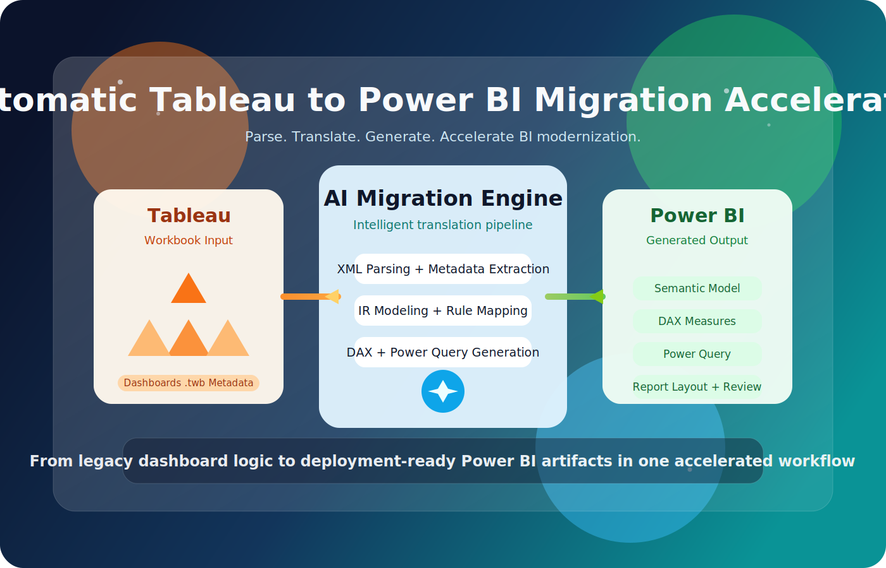
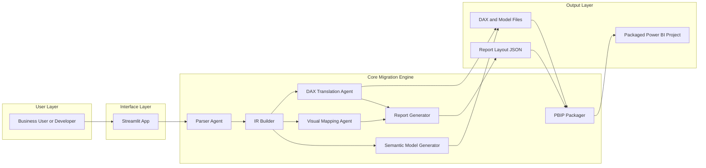
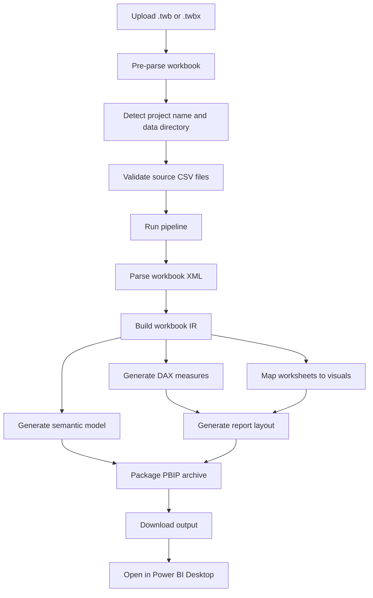

# VizAlchemy — Submission

---

## Project Image



---

## Entry

| Field | Details |
|---|---|
| **Project** | VizAlchemy — Tableau to Power BI Migration Accelerator |
| **Challenge** | Creative Apps - Build innovative creative applications using AI-assisted development|
| **Required Technology** | GitHub Copilot |
| **Repository** | [https://github.com/Shakthi99/VizAlchemy.git](https://github.com/Shakthi99/VizAlchemy.git) |
| **Demo Link** | _(add demo URL here)_ |

---

## Problem

Business intelligence teams that standardise on Microsoft Power BI face a significant manual effort when migrating existing Tableau workbooks. A typical migration requires:

- Manually reconstructing each data connection as a Power Query M expression.
- Rewriting every Tableau calculated field from Tableau's formula syntax into DAX.
- Recreating all worksheet visuals and dashboard layouts by hand inside Power BI Desktop.
- Building the semantic model, relationships, and table definitions from scratch.

For organisations with tens or hundreds of Tableau workbooks, this work can take months and is error-prone. There is no standard automated tooling that handles the full end-to-end migration from a Tableau `.twb` workbook into a directly openable Power BI project.

---

## Solution

VizAlchemy is a Python-based migration accelerator that reads a Tableau workbook and produces a ready-to-open Power BI project, without requiring Power BI Desktop to be open or any manual field-by-field reconstruction.

The solution works as a six-stage pipeline:

1. **Parse** — Reads the Tableau workbook XML and extracts datasources, tables, columns, relationships, worksheets, dashboards, calculated fields, and parameters into an internal intermediate representation.
2. **Translate** — Converts Tableau calculations and aggregation patterns into DAX measures using a pattern-matching engine.
3. **Map** — Converts Tableau worksheet marks and encodings into Power BI visual specifications, handling bar, line, area, pie, map, treemap, scatter, card, and more.
4. **Generate model** — Produces Power BI semantic model artefacts including table definitions, relationships, and Power Query M expressions for each data source.
5. **Generate report** — Creates the report layout JSON that positions visuals on each report page, preserving dashboard structure.
6. **Package** — Assembles all generated artefacts into a downloadable Power BI project archive that can be opened directly in Power BI Desktop.

A Streamlit web interface makes the tool accessible to non-engineers — upload a workbook, confirm settings, click run, and download the result.

### Architecture Overview



### Execution Flow



---

## Technologies

| Technology | Role in the Project |
|---|---|
| **Python 3.11+** | Core implementation language for all pipeline stages |
| **Streamlit** | Web UI for upload, configuration, and download |
| **lxml / ElementTree** | Tableau workbook XML parsing |
| **Pydantic v2** | Internal workbook IR and output models |
| **Click** | CLI interface for batch and single-file migration |
| **zipfile (stdlib)** | Assembles the downloadable Power BI project archive |
| **GitHub Copilot** | AI pair programming used throughout development — code generation, pattern catalogs, DAX translation logic, test scaffolding |

### Agent / Stage Breakdown

| Agent | Input | Output | Module |
|---|---|---|---|
| Streamlit UI Agent | Uploaded workbook, user config | Pipeline request, downloadable file | `streamlit_app.py` |
| Parser Agent | `.twb` / `.twbx` bytes | Parsed workbook structures | `tableau_to_powerbi/parser/` |
| IR Builder | Parsed workbook metadata | `WorkbookIR` models | `tableau_to_powerbi/ir/` |
| DAX Translation Agent | Workbook IR | DAX measures | `tableau_to_powerbi/translation/` |
| Visual Mapping Agent | Worksheets from IR | Visual specifications | `tableau_to_powerbi/mapping/` |
| Semantic Model Generator | Workbook IR, measures | TMDL and table artefacts | `tableau_to_powerbi/generator/semantic_model.py` |
| Report Generator | Visual specs, dashboard metadata | Report layout JSON | `tableau_to_powerbi/generator/report_generator.py` |
| PBIP Packager | Model and report files | Packaged archive bytes | `tableau_to_powerbi/generator/pbip_packager.py` |
| Pipeline Orchestrator | Workbook bytes, project settings | `PipelineResult` | `tableau_to_powerbi/pipeline.py` |

---

## How to Run

### Prerequisites

- Python 3.11 or later
- Power BI Desktop (for opening the generated output)
- CSV or other data files referenced by the Tableau workbook available locally

### Steps

**1. Clone the repository**

```bash
git clone https://github.com/Shakthi99/VizAlchemy.git
cd VizAlchemy
```

**2. Create and activate a virtual environment (Windows PowerShell)**

```powershell
python -m venv .venv
.\.venv\Scripts\Activate.ps1
```

**3. Install dependencies**

```powershell
pip install -r requirements.txt
```

**4. Run the Streamlit app**

```powershell
streamlit run streamlit_app.py
```

**5. Use the app**

1. Open the browser at `http://localhost:8501`.
2. Upload your Tableau workbook (`.twb` or `.twbx`).
3. Confirm or edit the suggested project name.
4. Confirm or edit the data directory path (where your source CSV files are located).
5. Review any pre-flight validation warnings about missing files or column mismatches.
6. Click **Run Migration**.
7. Download the generated Power BI project package.

**6. Open in Power BI Desktop**

1. Extract the downloaded archive to a local folder.
2. Open the generated project file in Power BI Desktop.
3. Update any data source paths if they differ on your machine.
4. Refresh the model and review the migrated visuals and measures.

### Sample Inputs Included in the Repo

| File | Description |
|---|---|
| `Shopping (1).twb` | Sample Tableau workbook with shopping analytics |
| `input_twb/sample_sales_dashboard.twb` | Sales dashboard sample workbook |
| `Dataset/` | Matching source CSV files for the shopping workbook |
| `Dataset_BK/` | Additional source CSV files |

---

## Judging Criteria Alignment

| Criteria | How VizAlchemy Addresses It |
|---|---|
| **Creativity** | Automates a complex, multi-step BI migration that has no existing open-source tooling — converts a Tableau workbook into a fully structured Power BI project without any manual reconstruction inside Power BI Desktop |
| **Use of GitHub Copilot** | GitHub Copilot was used throughout development to accelerate pattern catalog construction, DAX translation logic, Pydantic model scaffolding, visual mapping tables, and the Streamlit UI layout |
| **Technical Depth** | Six-stage pipeline with dedicated agents for parsing, IR construction, DAX translation, visual mapping, semantic model generation, and packaging — each stage is independently testable and extensible |
| **Practical Value** | Directly solves a real migration pain point for BI teams moving from Tableau to Power BI, reducing weeks of manual effort to minutes for standard workbooks |
| **Completeness** | Handles datasources, relationships, calculated fields, aggregations, 10+ visual types, dashboard layout, Power Query M, TMDL, and output packaging in a single tool |
| **Documentation** | Includes detailed `README.md`, architecture docs, mapping catalogs, DAX translation catalog, IR schema, test strategy, and an auto-generated code walkthrough document |

---

## Team

| Name | Role | MS Learn ID |
|---|---|---|
| **Shakthi Abirami RM** | Analyst | ShakthiAbirami-7207 |
